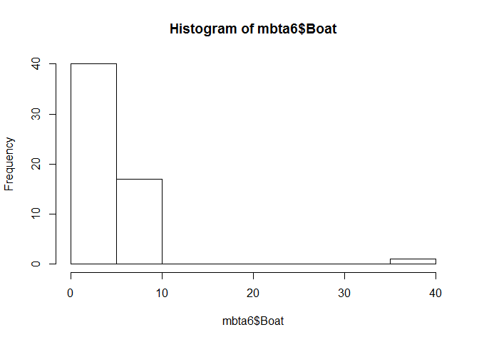
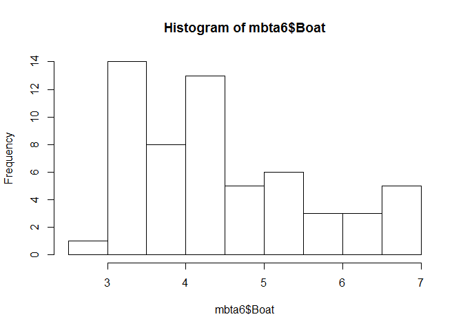
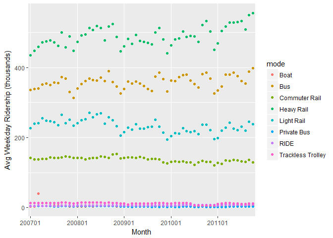
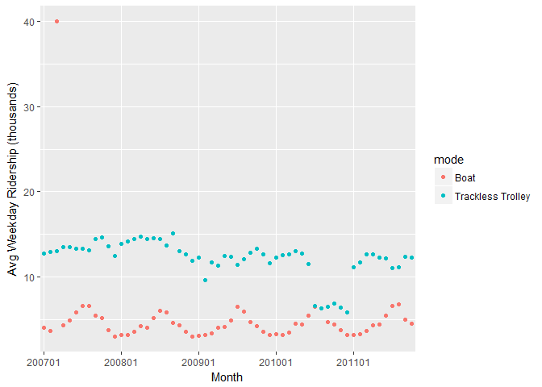

# Introduction
The Massachusetts Bay Transportation Authority ("MBTA" or just "the T" for short) manages America's oldest subway, as well as Greater Boston's commuter rail, ferry, and bus systems.

We will clean the data and do some visualizations there after.

We are going to clean this data using the following guidelines:

1. **Understand the structure of the data.**
    + Look at the data strucutre and remove any unecessary data.
2. **Tidy the data** by making sure that the three principles of tidy data are followed.We will make sure that:

    + Each variable forms a column.
    + Each observation forms a row.
    + Each type of observational unit forms a table.

We will use tidyr functions which include:

* **Spread:** If column names are stored a sobservations spread them into key-value pairs
* **Gather:** If observations are stored as column names gather them into Key-Value Pairs.
* **Unite** to unite multiple columns into one column.
* **Separate** to separate one column into multiple columns

3. **Prepare the data for analysis.** We will make sure that:

    + Variables are of the correct data type
        + Dates are well formatted. Use lubridate or zoo package.
        + Column types are correct. We will use coersions.
    + Missing values are dealt with
    + Extreme values are dealt with
    + Unexpected values are dealt with


The Massachusetts Bay Transportation Authority ("MBTA") is stored as an Excel spreadsheet called mbta.xlsx in the data folder that is inside the data cleaning folder. We will use the read_excel() function from Hadley Wickham's readxl package to import it.

In most cases excel spreadhseets have some rows that need to be skipped e.g title, total. However, the first time one imports a dataset, they might not know how many rows need to be skipped. So one needs to import the data and explore the first few rows, identify the ones that need to be ommited and omit them and save the resulting data frame to a new name. If one knows how many rows to skip then they can go ahead and skip them while importing. 


# Loading the required packages

We will import the excel data using the readxl package. We will require tidyr for data cleaning contained in the tidyverse package


```r
#Load the readxl library
library(readxl)

#Load the tidyverse library
library(tidyverse)
```

```
## -- Attaching packages --------------------------------------- tidyverse 1.2.1 --
```

```
## v ggplot2 2.2.1     v purrr   0.2.5
## v tibble  1.4.2     v dplyr   0.7.5
## v tidyr   0.8.1     v stringr 1.3.1
## v readr   1.1.1     v forcats 0.3.0
```

```
## -- Conflicts ------------------------------------------ tidyverse_conflicts() --
## x dplyr::filter() masks stats::filter()
## x dplyr::lag()    masks stats::lag()
```

```r
#Load the ggplot2 package
library(ggplot2)

#Load library stringr
library(stringr)
```

# Importing the data

Go to the data folder and open the excel file. You will realise that the first row is a title row which need to be skipped while importing.


```r
# Import mbta.xlsx and skip first row. Save the resulting data frame as mbta.
mbta<-read_excel("data/mbta.xlsx", skip=1)
```

# Exploring the data

Lets check out how the data is. We do this having the three principles of tidy data in mind.

```r
# View the structure of mbta
glimpse(mbta)
```

```
## Observations: 11
## Variables: 60
## $ X__1      <dbl> 1, 2, 3, 4, 5, 6, 7, 8, 9, 10, 11
## $ mode      <chr> "All Modes by Qtr", "Boat", "Bus", "Commuter Rail", ...
## $ `2007-01` <chr> "NA", "4", "335.819", "142.2", "435.294", "227.231",...
## $ `2007-02` <chr> "NA", "3.6", "338.675", "138.5", "448.271", "240.262...
## $ `2007-03` <dbl> 1187.653, 40.000, 339.867, 137.700, 458.583, 241.444...
## $ `2007-04` <chr> "NA", "4.3", "352.162", "139.5", "472.201", "255.557...
## $ `2007-05` <chr> "NA", "4.9", "354.367", "139", "474.579", "248.262",...
## $ `2007-06` <dbl> 1245.959, 5.800, 350.543, 143.000, 477.032, 246.108,...
## $ `2007-07` <chr> "NA", "6.521", "357.519", "142.391", "471.735", "243...
## $ `2007-08` <chr> "NA", "6.572", "355.479", "142.364", "461.605", "234...
## $ `2007-09` <dbl> 1256.571, 5.469, 372.598, 143.051, 499.566, 265.748,...
## $ `2007-10` <chr> "NA", "5.145", "368.847", "146.542", "457.741", "241...
## $ `2007-11` <chr> "NA", "3.763", "330.826", "145.089", "488.348", "250...
## $ `2007-12` <dbl> 1216.890, 2.985, 312.920, 141.585, 448.268, 233.379,...
## $ `2008-01` <chr> "NA", "3.175", "340.324", "142.145", "472.624", "241...
## $ `2008-02` <chr> "NA", "3.111", "352.905", "142.607", "492.1", "249.3...
## $ `2008-03` <dbl> 1253.522, 3.512, 361.155, 137.453, 494.046, 253.132,...
## $ `2008-04` <chr> "NA", "4.164", "368.189", "140.389", "513.204", "271...
## $ `2008-05` <chr> "NA", "4.015", "363.903", "142.585", "507.952", "258...
## $ `2008-06` <dbl> 1314.821, 5.189, 362.962, 142.057, 518.349, 266.961,...
## $ `2008-07` <chr> "NA", "6.016", "370.921", "145.731", "512.309", "270...
## $ `2008-08` <chr> "NA", "5.8", "361.057", "144.565", "476.99", "239.34...
## $ `2008-09` <dbl> 1307.041, 4.587, 389.537, 141.907, 517.324, 258.171,...
## $ `2008-10` <chr> "NA", "4.285", "357.974", "151.957", "523.644", "250...
## $ `2008-11` <chr> "NA", "3.488", "345.423", "152.952", "487.115", "232...
## $ `2008-12` <dbl> 1232.655, 3.007, 325.767, 140.810, 446.743, 205.420,...
## $ `2009-01` <chr> "NA", "3.014", "338.532", "141.448", "461.004", "215...
## $ `2009-02` <chr> "NA", "3.196", "360.412", "143.529", "482.407", "228...
## $ `2009-03` <dbl> 1209.792, 3.330, 353.686, 142.893, 467.224, 222.844,...
## $ `2009-04` <chr> "NA", "4.049", "359.38", "142.34", "493.152", "238.2...
## $ `2009-05` <chr> "NA", "4.119", "354.75", "144.225", "475.634", "224....
## $ `2009-06` <dbl> 1233.085, 4.900, 347.865, 142.006, 473.099, 226.259,...
## $ `2009-07` <chr> "NA", "6.444", "339.477", "137.691", "470.828", "230...
## $ `2009-08` <chr> "NA", "5.903", "332.661", "139.158", "466.676", "231...
## $ `2009-09` <dbl> 1230.461, 4.696, 374.260, 139.087, 500.403, 250.922,...
## $ `2009-10` <chr> "NA", "4.212", "385.868", "137.104", "513.406", "230...
## $ `2009-11` <chr> "NA", "3.576", "366.98", "129.343", "480.278", "214....
## $ `2009-12` <dbl> 1207.845, 3.113, 332.394, 126.066, 440.925, 194.446,...
## $ `2010-01` <chr> "NA", "3.207", "362.226", "130.91", "464.069", "204....
## $ `2010-02` <chr> "NA", "3.195", "361.138", "131.918", "480.121", "213...
## $ `2010-03` <dbl> 1208.857, 3.481, 373.443, 131.252, 483.397, 211.693,...
## $ `2010-04` <chr> "NA", "4.452", "378.611", "131.722", "502.374", "227...
## $ `2010-05` <chr> "NA", "4.415", "380.171", "128.8", "487.4", "217.805...
## $ `2010-06` <dbl> 1244.409, 5.411, 363.275, 129.144, 490.263, 215.922,...
## $ `2010-07` <chr> "NA", "6.513", "353.04", "122.935", "488.587", "218....
## $ `2010-08` <chr> "NA", "6.269", "343.688", "129.732", "473.731", "210...
## $ `2010-09` <dbl> 1225.527, 4.699, 381.622, 132.892, 521.099, 236.368,...
## $ `2010-10` <chr> "NA", "4.402", "384.987", "131.033", "532.403", "236...
## $ `2010-11` <chr> "NA", "3.731", "367.955", "130.889", "502.887", "221...
## $ `2010-12` <dbl> 1216.262, 3.156, 326.338, 121.422, 450.433, 196.211,...
## $ `2011-01` <chr> "NA", "3.14", "334.958", "128.396", "468.418", "198....
## $ `2011-02` <chr> "NA", "3.284", "346.234", "125.463", "504.068", "219...
## $ `2011-03` <dbl> 1223.452, 3.674, 380.399, 134.374, 516.730, 227.935,...
## $ `2011-04` <chr> "NA", "4.251", "380.446", "134.169", "528.631", "242...
## $ `2011-05` <chr> "NA", "4.431", "385.289", "136.14", "528.122", "225....
## $ `2011-06` <dbl> 1302.414, 5.474, 376.317, 135.581, 529.528, 221.865,...
## $ `2011-07` <chr> "NA", "6.581", "361.585", "132.41", "532.888", "231....
## $ `2011-08` <chr> "NA", "6.733", "353.793", "130.616", "508.145", "220...
## $ `2011-09` <dbl> 1290.549, 5.003, 388.271, 136.901, 550.137, 244.949,...
## $ `2011-10` <chr> "NA", "4.484", "398.456", "128.72", "554.932", "237....
```

```r
# View the first 6 rows of mbta
head(mbta)
```

```
## # A tibble: 6 x 60
##    X__1 mode   `2007-01` `2007-02` `2007-03` `2007-04` `2007-05` `2007-06`
##   <dbl> <chr>  <chr>     <chr>         <dbl> <chr>     <chr>         <dbl>
## 1     1 All M~ NA        NA            1188. NA        NA           1246. 
## 2     2 Boat   4         3.6             40  4.3       4.9             5.8
## 3     3 Bus    335.819   338.675        340. 352.162   354.367       351. 
## 4     4 Commu~ 142.2     138.5          138. 139.5     139           143  
## 5     5 Heavy~ 435.294   448.271        459. 472.201   474.579       477. 
## 6     6 Light~ 227.231   240.262        241. 255.557   248.262       246. 
## # ... with 52 more variables: `2007-07` <chr>, `2007-08` <chr>,
## #   `2007-09` <dbl>, `2007-10` <chr>, `2007-11` <chr>, `2007-12` <dbl>,
## #   `2008-01` <chr>, `2008-02` <chr>, `2008-03` <dbl>, `2008-04` <chr>,
## #   `2008-05` <chr>, `2008-06` <dbl>, `2008-07` <chr>, `2008-08` <chr>,
## #   `2008-09` <dbl>, `2008-10` <chr>, `2008-11` <chr>, `2008-12` <dbl>,
## #   `2009-01` <chr>, `2009-02` <chr>, `2009-03` <dbl>, `2009-04` <chr>,
## #   `2009-05` <chr>, `2009-06` <dbl>, `2009-07` <chr>, `2009-08` <chr>,
## #   `2009-09` <dbl>, `2009-10` <chr>, `2009-11` <chr>, `2009-12` <dbl>,
## #   `2010-01` <chr>, `2010-02` <chr>, `2010-03` <dbl>, `2010-04` <chr>,
## #   `2010-05` <chr>, `2010-06` <dbl>, `2010-07` <chr>, `2010-08` <chr>,
## #   `2010-09` <dbl>, `2010-10` <chr>, `2010-11` <chr>, `2010-12` <dbl>,
## #   `2011-01` <chr>, `2011-02` <chr>, `2011-03` <dbl>, `2011-04` <chr>,
## #   `2011-05` <chr>, `2011-06` <dbl>, `2011-07` <chr>, `2011-08` <chr>,
## #   `2011-09` <dbl>, `2011-10` <chr>
```

```r
# View the entire data set or View(mbta)
fix(mbta)

# View a summary of mbta
summary(mbta)
```

```
##       X__1          mode             2007-01            2007-02         
##  Min.   : 1.0   Length:11          Length:11          Length:11         
##  1st Qu.: 3.5   Class :character   Class :character   Class :character  
##  Median : 6.0   Mode  :character   Mode  :character   Mode  :character  
##  Mean   : 6.0                                                           
##  3rd Qu.: 8.5                                                           
##  Max.   :11.0                                                           
##     2007-03           2007-04            2007-05         
##  Min.   :   0.114   Length:11          Length:11         
##  1st Qu.:   9.278   Class :character   Class :character  
##  Median : 137.700   Mode  :character   Mode  :character  
##  Mean   : 330.293                                        
##  3rd Qu.: 399.225                                        
##  Max.   :1204.725                                        
##     2007-06           2007-07            2007-08         
##  Min.   :   0.096   Length:11          Length:11         
##  1st Qu.:   5.700   Class :character   Class :character  
##  Median : 143.000   Mode  :character   Mode  :character  
##  Mean   : 339.846                                        
##  3rd Qu.: 413.788                                        
##  Max.   :1246.129                                        
##     2007-09           2007-10            2007-11         
##  Min.   :  -0.007   Length:11          Length:11         
##  1st Qu.:   5.539   Class :character   Class :character  
##  Median : 143.051   Mode  :character   Mode  :character  
##  Mean   : 352.554                                        
##  3rd Qu.: 436.082                                        
##  Max.   :1310.764                                        
##     2007-12           2008-01            2008-02         
##  Min.   :  -0.060   Length:11          Length:11         
##  1st Qu.:   4.385   Class :character   Class :character  
##  Median : 141.585   Mode  :character   Mode  :character  
##  Mean   : 321.588                                        
##  3rd Qu.: 380.594                                        
##  Max.   :1216.890                                        
##     2008-03           2008-04            2008-05         
##  Min.   :   0.058   Length:11          Length:11         
##  1st Qu.:   5.170   Class :character   Class :character  
##  Median : 137.453   Mode  :character   Mode  :character  
##  Mean   : 345.604                                        
##  3rd Qu.: 427.601                                        
##  Max.   :1274.031                                        
##     2008-06           2008-07            2008-08         
##  Min.   :   0.060   Length:11          Length:11         
##  1st Qu.:   5.742   Class :character   Class :character  
##  Median : 142.057   Mode  :character   Mode  :character  
##  Mean   : 359.667                                        
##  3rd Qu.: 440.656                                        
##  Max.   :1320.728                                        
##     2008-09           2008-10            2008-11         
##  Min.   :   0.021   Length:11          Length:11         
##  1st Qu.:   5.691   Class :character   Class :character  
##  Median : 141.907   Mode  :character   Mode  :character  
##  Mean   : 362.099                                        
##  3rd Qu.: 453.430                                        
##  Max.   :1338.015                                        
##     2008-12           2009-01            2009-02         
##  Min.   :  -0.015   Length:11          Length:11         
##  1st Qu.:   4.689   Class :character   Class :character  
##  Median : 140.810   Mode  :character   Mode  :character  
##  Mean   : 319.882                                        
##  3rd Qu.: 386.255                                        
##  Max.   :1232.655                                        
##     2009-03           2009-04            2009-05         
##  Min.   :  -0.050   Length:11          Length:11         
##  1st Qu.:   5.003   Class :character   Class :character  
##  Median : 142.893   Mode  :character   Mode  :character  
##  Mean   : 330.142                                        
##  3rd Qu.: 410.455                                        
##  Max.   :1210.912                                        
##     2009-06           2009-07            2009-08         
##  Min.   :  -0.079   Length:11          Length:11         
##  1st Qu.:   5.845   Class :character   Class :character  
##  Median : 142.006   Mode  :character   Mode  :character  
##  Mean   : 333.194                                        
##  3rd Qu.: 410.482                                        
##  Max.   :1233.085                                        
##     2009-09           2009-10            2009-11         
##  Min.   :  -0.035   Length:11          Length:11         
##  1st Qu.:   5.693   Class :character   Class :character  
##  Median : 139.087   Mode  :character   Mode  :character  
##  Mean   : 346.687                                        
##  3rd Qu.: 437.332                                        
##  Max.   :1291.564                                        
##     2009-12           2010-01            2010-02         
##  Min.   :  -0.022   Length:11          Length:11         
##  1st Qu.:   4.784   Class :character   Class :character  
##  Median : 126.066   Mode  :character   Mode  :character  
##  Mean   : 312.962                                        
##  3rd Qu.: 386.659                                        
##  Max.   :1207.845                                        
##     2010-03           2010-04            2010-05         
##  Min.   :   0.012   Length:11          Length:11         
##  1st Qu.:   5.274   Class :character   Class :character  
##  Median : 131.252   Mode  :character   Mode  :character  
##  Mean   : 332.726                                        
##  3rd Qu.: 428.420                                        
##  Max.   :1225.556                                        
##     2010-06           2010-07            2010-08         
##  Min.   :   0.008   Length:11          Length:11         
##  1st Qu.:   6.436   Class :character   Class :character  
##  Median : 129.144   Mode  :character   Mode  :character  
##  Mean   : 335.964                                        
##  3rd Qu.: 426.769                                        
##  Max.   :1244.409                                        
##     2010-09           2010-10            2010-11         
##  Min.   :   0.001   Length:11          Length:11         
##  1st Qu.:   5.567   Class :character   Class :character  
##  Median : 132.892   Mode  :character   Mode  :character  
##  Mean   : 346.524                                        
##  3rd Qu.: 451.361                                        
##  Max.   :1293.117                                        
##     2010-12           2011-01            2011-02         
##  Min.   :  -0.004   Length:11          Length:11         
##  1st Qu.:   4.466   Class :character   Class :character  
##  Median : 121.422   Mode  :character   Mode  :character  
##  Mean   : 312.917                                        
##  3rd Qu.: 388.385                                        
##  Max.   :1216.262                                        
##     2011-03          2011-04            2011-05         
##  Min.   :   0.05   Length:11          Length:11         
##  1st Qu.:   6.03   Class :character   Class :character  
##  Median : 134.37   Mode  :character   Mode  :character  
##  Mean   : 345.17                                        
##  3rd Qu.: 448.56                                        
##  Max.   :1286.66                                        
##     2011-06           2011-07            2011-08         
##  Min.   :   0.054   Length:11          Length:11         
##  1st Qu.:   6.926   Class :character   Class :character  
##  Median : 135.581   Mode  :character   Mode  :character  
##  Mean   : 353.331                                        
##  3rd Qu.: 452.923                                        
##  Max.   :1302.414                                        
##     2011-09           2011-10         
##  Min.   :   0.043   Length:11         
##  1st Qu.:   6.660   Class :character  
##  Median : 136.901   Mode  :character  
##  Mean   : 362.555                     
##  3rd Qu.: 469.204                     
##  Max.   :1348.754
```

The following issues have arised from exploring the data:

1. There is a unnecessary column. i.e the first column which lists the observations.
2. There are unnecessary rows:
    + All mode by Qtr row. This 1st row is a quarterly average of weekday MBTA ridership. Since this dataset tracks monthly average ridership, this row does not belong to this data frame. Furthermore, this explains why it has missing data.
    + Pct Chg / Yr row. This 7th row is not an observation but an analysis
    + TOTAL row. This 11th row is not an observation but an analysis. 
    
3. There is missing data.
    + There is missing data in 'All mode by Qtr' row. This dataset tracks monthly average ridership. However, this 1st row is a quarterly average of weekday MBTA ridership and this explains why it is has missing data.
4. Observations(values) i.e months are stored as columns rather than as rows.
5. Column names(variables) i.e *mode* are stored as rows rather than as columns.

# Cleaning the data
We tidy the data first, then prepare the data for data analysis.

## Tidying the data
In this section we are going to tidy the data by dealing with the above data quality issues from issue number 1 to number 5.

### Removing the unnecessary column


```r
# Remove the first column of mbta and save the new data frame as mbta1
mbta1<-mbta[, -1]

#view the changes
head(mbta1)
```

```
##               mode 2007-01 2007-02  2007-03 2007-04 2007-05  2007-06
## 1 All Modes by Qtr      NA      NA 1187.653      NA      NA 1245.959
## 2             Boat       4     3.6   40.000     4.3     4.9    5.800
## 3              Bus 335.819 338.675  339.867 352.162 354.367  350.543
## 4    Commuter Rail   142.2   138.5  137.700   139.5     139  143.000
## 5       Heavy Rail 435.294 448.271  458.583 472.201 474.579  477.032
## 6       Light Rail 227.231 240.262  241.444 255.557 248.262  246.108
##   2007-07 2007-08  2007-09 2007-10 2007-11  2007-12 2008-01 2008-02
## 1      NA      NA 1256.571      NA      NA 1216.890      NA      NA
## 2   6.521   6.572    5.469   5.145   3.763    2.985   3.175   3.111
## 3 357.519 355.479  372.598 368.847 330.826  312.920 340.324 352.905
## 4 142.391 142.364  143.051 146.542 145.089  141.585 142.145 142.607
## 5 471.735 461.605  499.566 457.741 488.348  448.268 472.624   492.1
## 6 243.286 234.907  265.748 241.434 250.497  233.379 241.223 249.306
##    2008-03 2008-04 2008-05  2008-06 2008-07 2008-08  2008-09 2008-10
## 1 1253.522      NA      NA 1314.821      NA      NA 1307.041      NA
## 2    3.512   4.164   4.015    5.189   6.016     5.8    4.587   4.285
## 3  361.155 368.189 363.903  362.962 370.921 361.057  389.537 357.974
## 4  137.453 140.389 142.585  142.057 145.731 144.565  141.907 151.957
## 5  494.046 513.204 507.952  518.349 512.309  476.99  517.324 523.644
## 6  253.132  271.07 258.351  266.961 270.158 239.344  258.171 250.063
##   2008-11  2008-12 2009-01 2009-02  2009-03 2009-04 2009-05  2009-06
## 1      NA 1232.655      NA      NA 1209.792      NA      NA 1233.085
## 2   3.488    3.007   3.014   3.196    3.330   4.049   4.119    4.900
## 3 345.423  325.767 338.532 360.412  353.686  359.38  354.75  347.865
## 4 152.952  140.810 141.448 143.529  142.893  142.34 144.225  142.006
## 5 487.115  446.743 461.004 482.407  467.224 493.152 475.634  473.099
## 6 232.068  205.420  215.66 228.737  222.844 238.232 224.962  226.259
##   2009-07 2009-08  2009-09 2009-10 2009-11  2009-12 2010-01 2010-02
## 1      NA      NA 1230.461      NA      NA 1207.845      NA      NA
## 2   6.444   5.903    4.696   4.212   3.576    3.113   3.207   3.195
## 3 339.477 332.661  374.260 385.868  366.98  332.394 362.226 361.138
## 4 137.691 139.158  139.087 137.104 129.343  126.066  130.91 131.918
## 5 470.828 466.676  500.403 513.406 480.278  440.925 464.069 480.121
## 6 230.308 231.783  250.922 230.739 214.711  194.446 204.396 213.136
##    2010-03 2010-04 2010-05  2010-06 2010-07 2010-08  2010-09 2010-10
## 1 1208.857      NA      NA 1244.409      NA      NA 1225.527      NA
## 2    3.481   4.452   4.415    5.411   6.513   6.269    4.699   4.402
## 3  373.443 378.611 380.171  363.275  353.04 343.688  381.622 384.987
## 4  131.252 131.722   128.8  129.144 122.935 129.732  132.892 131.033
## 5  483.397 502.374   487.4  490.263 488.587 473.731  521.099 532.403
## 6  211.693 227.246 217.805  215.922 218.729  210.53  236.368 236.366
##   2010-11  2010-12 2011-01 2011-02  2011-03 2011-04 2011-05  2011-06
## 1      NA 1216.262      NA      NA 1223.452      NA      NA 1302.414
## 2   3.731    3.156    3.14   3.284    3.674   4.251   4.431    5.474
## 3 367.955  326.338 334.958 346.234  380.399 380.446 385.289  376.317
## 4 130.889  121.422 128.396 125.463  134.374 134.169  136.14  135.581
## 5 502.887  450.433 468.418 504.068  516.730 528.631 528.122  529.528
## 6 221.881  196.211  198.45 219.886  227.935  242.28 225.776  221.865
##   2011-07 2011-08  2011-09 2011-10
## 1      NA      NA 1290.549      NA
## 2   6.581   6.733    5.003   4.484
## 3 361.585 353.793  388.271 398.456
## 4  132.41 130.616  136.901  128.72
## 5 532.888 508.145  550.137 554.932
## 6  231.01 220.164  244.949 237.768
```

### Removing the unnecessary rows


```r
# Remove rows 1, 7, and 11 of mbta: mbta2
mbta2<-mbta1[-c(1,7,11),]

# view the changes
View(mbta2)
```

### Dealing with the missing data

There is missing data in 'All mode by Qtr' row. This dataset tracks monthly average ridership. However, this 1st row is a quarterly average of weekday MBTA ridership and this explains why it is has missing data.

We have already removed this row as a unnecessary row.

### Gathering the columns

Observations(values) i.e months are stored as columns rather than as rows.

Viewing mbta2 shows that the months themselves are observations but have been stored as varialbes/columns. You can tell that the months are observations because as you go through time, the month changes.

According to tidy data principles and as is customary, we should represent observations in rows rather than columns. We will use the gather() function from the tidyr package, to gather the columns of mbta2. We will also Use the - operator to omit the *mode* column. We will call our new columns *month* and *thou_riders* (for "thousand riders") and assign the result to mbta3.


```r
#view mbta2
View(mbta2)

# Gather columns of mbta2: mbta3. Leave out the *mode* column.
mbta3<-gather(mbta2, month, thou_riders, -mode)

# View the head of mbta3
head(mbta3)
```

```
##            mode   month thou_riders
## 1          Boat 2007-01           4
## 2           Bus 2007-01     335.819
## 3 Commuter Rail 2007-01       142.2
## 4    Heavy Rail 2007-01     435.294
## 5    Light Rail 2007-01     227.231
## 6   Private Bus 2007-01       4.772
```

Gathering has placed observations in rows.

### Spreading the columns

Column names(variables) i.e *mode* are stored as rows rather than as columns.

Viewing mbta3 shows that the *mode* themselves are column names (variable names) but have been stored as rows. You can tell that the *mode* are column names because as you go through time, the *mode* does not change.

According to tidy data principles and as is customary, we should represent variables in a column. We will use the spread() function from the tidyr package, to spread the *mode* column across multiple columns each column representing a variable. We will spread it on the variable *thou_riders*.


```r
#view mbta3
View(mbta3)

# Spread the mode column of mbta3: mbta4. 
mbta4<-spread(mbta3, mode, thou_riders)

# View the head of mbta4
head(mbta4)
```

```
##     month Boat     Bus Commuter Rail Heavy Rail Light Rail Private Bus
## 1 2007-01    4 335.819         142.2    435.294    227.231       4.772
## 2 2007-02  3.6 338.675         138.5    448.271    240.262       4.417
## 3 2007-03   40 339.867         137.7    458.583    241.444       4.574
## 4 2007-04  4.3 352.162         139.5    472.201    255.557       4.542
## 5 2007-05  4.9 354.367           139    474.579    248.262       4.768
## 6 2007-06  5.8 350.543           143    477.032    246.108       4.722
##   RIDE Trackless Trolley
## 1  4.9            12.757
## 2    5            12.913
## 3  5.5            13.057
## 4  5.4            13.444
## 5  5.4            13.479
## 6  5.6            13.323
```

Spreading has placed mode in columns.

The data is now tidy!!!

## Preparing the data for analysis.We will make sure that:

    + Variables are of the correct data type.
        + Dates are well formatted. We will use the zoo package since the lubridate package does not have a year-month version.
        + Column types are correct. We will use coersions.
    + Extreme values are dealt with.
    + Unexpected values are dealt with.

Before we begin let us explore our  tidy data set.

### Exploring our tidy data.


```r
# View the structure of mbta4
glimpse(mbta4)
```

```
## Observations: 58
## Variables: 9
## $ month               <chr> "2007-01", "2007-02", "2007-03", "2007-04"...
## $ Boat                <chr> "4", "3.6", "40", "4.3", "4.9", "5.8", "6....
## $ Bus                 <chr> "335.819", "338.675", "339.867", "352.162"...
## $ `Commuter Rail`     <chr> "142.2", "138.5", "137.7", "139.5", "139",...
## $ `Heavy Rail`        <chr> "435.294", "448.271", "458.583", "472.201"...
## $ `Light Rail`        <chr> "227.231", "240.262", "241.444", "255.557"...
## $ `Private Bus`       <chr> "4.772", "4.417", "4.574", "4.542", "4.768...
## $ RIDE                <chr> "4.9", "5", "5.5", "5.4", "5.4", "5.6", "5...
## $ `Trackless Trolley` <chr> "12.757", "12.913", "13.057", "13.444", "1...
```

```r
# View the first 6 rows of mbta4
head(mbta4)
```

```
##     month Boat     Bus Commuter Rail Heavy Rail Light Rail Private Bus
## 1 2007-01    4 335.819         142.2    435.294    227.231       4.772
## 2 2007-02  3.6 338.675         138.5    448.271    240.262       4.417
## 3 2007-03   40 339.867         137.7    458.583    241.444       4.574
## 4 2007-04  4.3 352.162         139.5    472.201    255.557       4.542
## 5 2007-05  4.9 354.367           139    474.579    248.262       4.768
## 6 2007-06  5.8 350.543           143    477.032    246.108       4.722
##   RIDE Trackless Trolley
## 1  4.9            12.757
## 2    5            12.913
## 3  5.5            13.057
## 4  5.4            13.444
## 5  5.4            13.479
## 6  5.6            13.323
```

```r
# View the entire data set or View(mbta4)
fix(mbta4)

#View the summary of mbta4
summary(mbta4)
```

```
##     month               Boat               Bus           
##  Length:58          Length:58          Length:58         
##  Class :character   Class :character   Class :character  
##  Mode  :character   Mode  :character   Mode  :character  
##  Commuter Rail       Heavy Rail         Light Rail       
##  Length:58          Length:58          Length:58         
##  Class :character   Class :character   Class :character  
##  Mode  :character   Mode  :character   Mode  :character  
##  Private Bus            RIDE           Trackless Trolley 
##  Length:58          Length:58          Length:58         
##  Class :character   Class :character   Class :character  
##  Mode  :character   Mode  :character   Mode  :character
```

#### Observed issues with our tidy data

From the above explorations it is evident that all the data types are wrong. All columns except the month column should be numeric and the month column itself should be in the date format. With this in mind, the summary script ain't even necessary as it will give erroneous results.

### Type conversion 

We will do type conversions for all the columns. For the month column We will use the zoo package since the lubridate package does not have a year-month version. Anf for the other columns we will apply coersions.

#### Converting all the columns except date column i.e month to numeric

We will convert all the columns except month to numeric since their values are of type numeric.

```r
cols_to_change = c(2:9)
for(i in cols_to_change){
 class(mbta4[, i]) = "numeric"
}
glimpse(mbta4)
```

```
## Observations: 58
## Variables: 9
## $ month               <chr> "2007-01", "2007-02", "2007-03", "2007-04"...
## $ Boat                <dbl> 4.000, 3.600, 40.000, 4.300, 4.900, 5.800,...
## $ Bus                 <dbl> 335.819, 338.675, 339.867, 352.162, 354.36...
## $ `Commuter Rail`     <dbl> 142.200, 138.500, 137.700, 139.500, 139.00...
## $ `Heavy Rail`        <dbl> 435.294, 448.271, 458.583, 472.201, 474.57...
## $ `Light Rail`        <dbl> 227.231, 240.262, 241.444, 255.557, 248.26...
## $ `Private Bus`       <dbl> 4.772, 4.417, 4.574, 4.542, 4.768, 4.722, ...
## $ RIDE                <dbl> 4.900, 5.000, 5.500, 5.400, 5.400, 5.600, ...
## $ `Trackless Trolley` <dbl> 12.757, 12.913, 13.057, 13.444, 13.479, 13...
```

#### Converting dates

The month column has year concatenated with month,but no day. I will use the zoo package since the lubridate package does not have a year-month version.

```r
#Loading the zoo package
library(zoo)
```

```
## 
## Attaching package: 'zoo'
```

```
## The following objects are masked from 'package:base':
## 
##     as.Date, as.Date.numeric
```

```r
#Let us view the day format
head(mbta4$month)# It is in the format year-month i.e "2007-03"
```

```
## [1] "2007-01" "2007-02" "2007-03" "2007-04" "2007-05" "2007-06"
```

```r
#converting the month column into date
mbta4$month<-as.yearmon(mbta4$month,"%Y-%m") 

#vewing the str of mbta4
glimpse(mbta4)
```

```
## Observations: 58
## Variables: 9
## $ month               <S3: yearmon> Jan 2007, Feb 2007, Mar 2007, Apr ...
## $ Boat                <dbl> 4.000, 3.600, 40.000, 4.300, 4.900, 5.800,...
## $ Bus                 <dbl> 335.819, 338.675, 339.867, 352.162, 354.36...
## $ `Commuter Rail`     <dbl> 142.200, 138.500, 137.700, 139.500, 139.00...
## $ `Heavy Rail`        <dbl> 435.294, 448.271, 458.583, 472.201, 474.57...
## $ `Light Rail`        <dbl> 227.231, 240.262, 241.444, 255.557, 248.26...
## $ `Private Bus`       <dbl> 4.772, 4.417, 4.574, 4.542, 4.768, 4.722, ...
## $ RIDE                <dbl> 4.900, 5.000, 5.500, 5.400, 5.400, 5.600, ...
## $ `Trackless Trolley` <dbl> 12.757, 12.913, 13.057, 13.444, 13.479, 13...
```

### Dealing with the converted dates

Let us take a closer look at our dates.

#### Separating the month column into new columns month and year

Our dataset is already looking much better! If we wanted to to do an analysis of the T's ridership during certain months across all years, it would be a piece of cake because our dataset has month names in it.
However, there's only one small problem: if we want to look at ridership on the T during every January (for example), the month and year are together in the same column, which makes it a little tricky.

We are now going to separate the month column into distinct month and year columns to make life easier. We will use the tidyr separate columns function.


```r
#before splitting the month column first view the date format
head(mbta4$month)
```

```
## [1] "Jan 2007" "Feb 2007" "Mar 2007" "Apr 2007" "May 2007" "Jun 2007"
```

```r
# Split month column into month and year: mbta5
mbta5<-separate(mbta4, month, c("month", "year"), sep=" ")

#Let us view the head of mbta5
head(mbta5)
```

```
##   month year Boat     Bus Commuter Rail Heavy Rail Light Rail Private Bus
## 1   Jan 2007  4.0 335.819         142.2    435.294    227.231       4.772
## 2   Feb 2007  3.6 338.675         138.5    448.271    240.262       4.417
## 3   Mar 2007 40.0 339.867         137.7    458.583    241.444       4.574
## 4   Apr 2007  4.3 352.162         139.5    472.201    255.557       4.542
## 5   May 2007  4.9 354.367         139.0    474.579    248.262       4.768
## 6   Jun 2007  5.8 350.543         143.0    477.032    246.108       4.722
##   RIDE Trackless Trolley
## 1  4.9            12.757
## 2  5.0            12.913
## 3  5.5            13.057
## 4  5.4            13.444
## 5  5.4            13.479
## 6  5.6            13.323
```

#### Reordering Columns: year should come before month

Viewing mbta5 shows that month comes before year yet conventionally it should be the other way round. Let us now reorder the columns


```r
#Let us reorder the columns: year should come before month: mbta6 
#We Will use indeces.
mbta6<-mbta5[,c(2, 1, 3:9)]

#let us view the head of mbta6
head(mbta6)
```

```
##   year month Boat     Bus Commuter Rail Heavy Rail Light Rail Private Bus
## 1 2007   Jan  4.0 335.819         142.2    435.294    227.231       4.772
## 2 2007   Feb  3.6 338.675         138.5    448.271    240.262       4.417
## 3 2007   Mar 40.0 339.867         137.7    458.583    241.444       4.574
## 4 2007   Apr  4.3 352.162         139.5    472.201    255.557       4.542
## 5 2007   May  4.9 354.367         139.0    474.579    248.262       4.768
## 6 2007   Jun  5.8 350.543         143.0    477.032    246.108       4.722
##   RIDE
## 1  4.9
## 2  5.0
## 3  5.5
## 4  5.4
## 5  5.4
## 6  5.6
```

### Dealing with obvious mistakes and/or outliers

Before you write up any analysis, it's a good idea to screen the data for any obvious mistakes and/or outliers.

There are many valid exploratory techniques for doing this; we will use a couple of them here which include:

+ Summary
+ Histogram
+ Box plot
+ Scatter plot


```r
# View a summary of mbta6
summary(mbta6)
```

```
##      year              month                Boat             Bus       
##  Length:58          Length:58          Min.   : 2.985   Min.   :312.9  
##  Class :character   Class :character   1st Qu.: 3.494   1st Qu.:345.6  
##  Mode  :character   Mode  :character   Median : 4.293   Median :359.9  
##                                        Mean   : 5.068   Mean   :358.6  
##                                        3rd Qu.: 5.356   3rd Qu.:372.2  
##                                        Max.   :40.000   Max.   :398.5  
##  Commuter Rail     Heavy Rail      Light Rail     Private Bus   
##  Min.   :121.4   Min.   :435.3   Min.   :194.4   Min.   :2.213  
##  1st Qu.:131.4   1st Qu.:471.1   1st Qu.:220.6   1st Qu.:2.641  
##  Median :138.8   Median :487.3   Median :231.9   Median :2.820  
##  Mean   :137.4   Mean   :489.3   Mean   :233.0   Mean   :3.352  
##  3rd Qu.:142.4   3rd Qu.:511.3   3rd Qu.:244.5   3rd Qu.:4.167  
##  Max.   :153.0   Max.   :554.9   Max.   :271.1   Max.   :4.878  
##       RIDE      
##  Min.   :4.900  
##  1st Qu.:5.965  
##  Median :6.615  
##  Mean   :6.604  
##  3rd Qu.:7.149  
##  Max.   :8.598
```

The above summary shows that the Boat column has an outlier which is also an obvious error.

This error is the maximum value which is 40. Looking at the distribution of the data i.e min,median and mean it is evident that number 40 is a typo with a zero added afetr 4 hence an obious error.

Let's explore the boat column further.


```r
# Generate a histogram of Boat column
hist(mbta6$Boat)
```

<!-- -->

The above histogram is quite interesting – every value clustered around 4 and one loner out around 40.

Every month, average weekday commuter boat ridership was on either side of four thousand. Then, one month it jumped to 40 thousand without warning?

We can assume that whoever was entering the data that month accidentally typed 40 instead of 4.

Because it's an error, we don't want this value influencing your analysis. So, we'll locate the incorrect value and change it to 4.


```r
# Find the row number of the incorrect value: i
i<-which(mbta6$Boat==40)

# Replace the incorrect value with 4
mbta6$Boat[i]<-4

# Generate a histogram of Boat column to verify that the change occurred
hist(mbta6$Boat)
```

<!-- -->

Phew the outlier has been modified to the correct value as show by the above histogram.

# Visualizing different versions of the data

The purpose of this section is to emphasize on the use of different data formats for different purposes analytics and visualization purposes. This is why we kept on saving data with different names at every stage of the data cleaning process.

We will now use the long version of the data named , **mbta3**, to produce some cool ridership plots: 

1. One showing all modes of transport.
2. One showing the lesser-used modes of transport (take a look at the gorgeous seasonal variation in Boat ridership), and 
 

_**NB: The plots are based on the long version of the data we produced named mbta3 -- a good example of using different data formats for different purposes.**_

Let us begin with the first plot that shows that shows all modes of transport.
We will use the long version of the data named , **mbta3**, to produce this plot. Let us see how this data is formatted first, then format further if necessary after which we will plot it.


```r
#checking out the format of mbta4
head(mbta3)
```

```
##            mode   month thou_riders
## 1          Boat 2007-01           4
## 2           Bus 2007-01     335.819
## 3 Commuter Rail 2007-01       142.2
## 4    Heavy Rail 2007-01     435.294
## 5    Light Rail 2007-01     227.231
## 6   Private Bus 2007-01       4.772
```

```r
#We will do a few modifications to this data and save it as mbta3_modified_all

#create mbta3_modified_all as a copy of mbta3
mbta3_modified_all<- mbta3

# Remove the "-" from month column, so that putting breaks at x axis work
mbta3_modified_all$month<-str_remove(mbta3_modified_all$month, "-")

#Convert month and mode to factors
mbta3_modified_all$month<- as.factor(mbta3_modified_all$month)
mbta3_modified_all$mode<- as.factor(mbta3_modified_all$mode)

#convert thou_riders to numeric
mbta3_modified_all$thou_riders<- as.numeric(mbta3_modified_all$thou_riders)

# Look at all T ridership over time
ggplot(mbta3_modified_all, aes(x = month, y = thou_riders, col = mode)) +  geom_point() + 
  scale_x_discrete(name = "Month", breaks = c(200701, 200801, 200901, 201001, 201101)) + 
  scale_y_continuous(name = "Avg Weekday Ridership (thousands)")
```

<!-- -->


Let us do the second plot that shows the lesser-used modes of transport (take a look at the gorgeous seasonal variation in Boat ridership)

We are going to create *mbta3_modified_boat* data frame from *mbta3_modified_all* data frame. *mbta3_modified_boat* will only have two modes i.e *Boat* and *Trackless Trolley*.


```r
#mbta3_modified_boat with only two modes :Boat and Trackless Trolley.
mbta3_modified_boat<-mbta3_modified_all[mbta3_modified_all$mode==c("Boat","Trackless Trolley"),]

# Look at Boat and Trackless Trolley ridership over time
ggplot(mbta3_modified_boat, aes(x = month, y = thou_riders, col = mode )) + geom_point() + 
  scale_x_discrete(name = "Month", breaks = c(200701, 200801, 200901, 201001, 201101)) +  
  scale_y_continuous(name = "Avg Weekday Ridership (thousands)")
```

<!-- -->

# Conclusion

Data cleaning is the most important part of data analysis as clean data will most of the time give the correct insights. To be highly skilled in data cleaning, one is required to clean different data sets as you will find that  different data sets have different data cleaning requirements.


