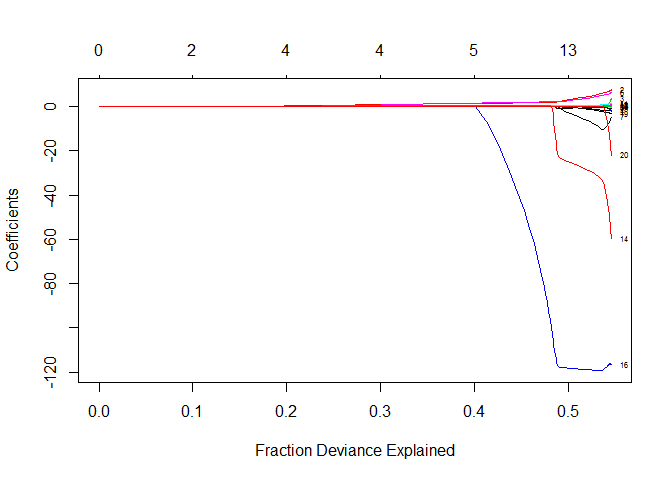
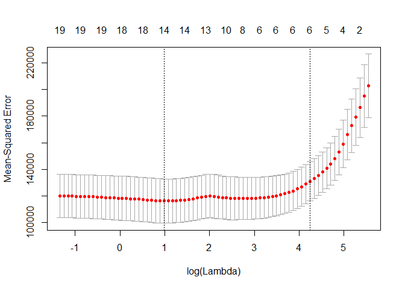

# .

# Introduction
There are three types of feature selection methods in general:

1. Filter Methods : filter methods are generally used as a preprocessing step. The selection of features is independent of any machine learning algorithm. Instead the features are selected on the basis of their scores in various statistical tests for their correlation with the outcome variable. Some common filter methods are Correlation metrics (Pearson, Spearman, Distance), Chi-Squared test, Anova, Fisher's Score etc.

2. Wrapper Methods : in wrapper methods, you try to use a subset of features and train a model using them. Based on the inferences that you draw from the previous model, you decide to add or remove features from the subset. Forward Selection, Backward elimination are some of the examples for wrapper methods.

3. Embedded Methods : these are the algorithms that have their own built-in feature selection methods. LASSO regression is one such example.

The lasso does:

* Coefficient shrinkage and 
* Variable selection, by ensuring that certain coefficients are actually equal to zero leaving those that are highly correlated to the output.

We are going to fit a lasso model using two algorithms of the glmnet package:

1. Glmnet: 
glmnet() is a R package which can be used to fit Regression models,lasso model and others. Alpha argument determines what type of model is fit. When alpha=0, Ridge Model is fit and if alpha=1, a lasso model is fit.
By default, glmnet() will perform Ridge or Lasso regression for an automatically selected range of lambda which may not give the lowest test MSE. Cv.glmnet is better.

2. Cv.glmnet: 
cv.glmnet() performs cross-validation, by default 10-fold which can be adjusted using nfolds. A 10-fold CV will randomly divide your observations into 10 non-overlapping groups/folds of approx equal size. The first fold will be used for validation set and the model is fit on 9 folds. Bias Variance advantages is usually the motivation behind using such model validation methods. In the case of lasso and ridge models, CV helps choose the value of the tuning parameter lambda.
The chosen optimal lamda/tuning parameter has corresponding non-zero coefficients of the important features/varialbes hence feature selection.

# Fitting a lasso model with glmnet

First of all we will load the required packages. 

##Loading the required packages

Load the required libraries.
The ISLR package, contains the hitters data.


```r
library(glmnet)
```

```
## Loading required package: Matrix
```

```
## Loading required package: foreach
```

```
## Loaded glmnet 2.0-16
```

```r
library(ISLR)
library(tidyverse)
```

```
## -- Attaching packages -------------------------------------------- tidyverse 1.2.1 --
```

```
## v ggplot2 2.2.1     v purrr   0.2.5
## v tibble  1.4.2     v dplyr   0.7.5
## v tidyr   0.8.1     v stringr 1.3.1
## v readr   1.1.1     v forcats 0.3.0
```

```
## -- Conflicts ----------------------------------------------- tidyverse_conflicts() --
## x purrr::accumulate() masks foreach::accumulate()
## x tidyr::expand()     masks Matrix::expand()
## x dplyr::filter()     masks stats::filter()
## x dplyr::lag()        masks stats::lag()
## x purrr::when()       masks foreach::when()
```

## Exlporing the data:Missing Values

Check for and remove missing values and save the resulting dataframe as "Hitters_Without_NAS"


```r
#check the data types of individual features
glimpse(Hitters)
```

```
## Observations: 322
## Variables: 20
## $ AtBat     <int> 293, 315, 479, 496, 321, 594, 185, 298, 323, 401, 57...
## $ Hits      <int> 66, 81, 130, 141, 87, 169, 37, 73, 81, 92, 159, 53, ...
## $ HmRun     <int> 1, 7, 18, 20, 10, 4, 1, 0, 6, 17, 21, 4, 13, 0, 7, 3...
## $ Runs      <int> 30, 24, 66, 65, 39, 74, 23, 24, 26, 49, 107, 31, 48,...
## $ RBI       <int> 29, 38, 72, 78, 42, 51, 8, 24, 32, 66, 75, 26, 61, 1...
## $ Walks     <int> 14, 39, 76, 37, 30, 35, 21, 7, 8, 65, 59, 27, 47, 22...
## $ Years     <int> 1, 14, 3, 11, 2, 11, 2, 3, 2, 13, 10, 9, 4, 6, 13, 3...
## $ CAtBat    <int> 293, 3449, 1624, 5628, 396, 4408, 214, 509, 341, 520...
## $ CHits     <int> 66, 835, 457, 1575, 101, 1133, 42, 108, 86, 1332, 13...
## $ CHmRun    <int> 1, 69, 63, 225, 12, 19, 1, 0, 6, 253, 90, 15, 41, 4,...
## $ CRuns     <int> 30, 321, 224, 828, 48, 501, 30, 41, 32, 784, 702, 19...
## $ CRBI      <int> 29, 414, 266, 838, 46, 336, 9, 37, 34, 890, 504, 186...
## $ CWalks    <int> 14, 375, 263, 354, 33, 194, 24, 12, 8, 866, 488, 161...
## $ League    <fct> A, N, A, N, N, A, N, A, N, A, A, N, N, A, N, A, N, A...
## $ Division  <fct> E, W, W, E, E, W, E, W, W, E, E, W, E, E, E, W, W, W...
## $ PutOuts   <int> 446, 632, 880, 200, 805, 282, 76, 121, 143, 0, 238, ...
## $ Assists   <int> 33, 43, 82, 11, 40, 421, 127, 283, 290, 0, 445, 45, ...
## $ Errors    <int> 20, 10, 14, 3, 4, 25, 7, 9, 19, 0, 22, 11, 7, 6, 8, ...
## $ Salary    <dbl> NA, 475.000, 480.000, 500.000, 91.500, 750.000, 70.0...
## $ NewLeague <fct> A, N, A, N, N, A, A, A, N, A, A, N, N, A, N, A, N, A...
```

```r
#summary Hitters
summary(Hitters)
```

```
##      AtBat            Hits         HmRun            Runs       
##  Min.   : 16.0   Min.   :  1   Min.   : 0.00   Min.   :  0.00  
##  1st Qu.:255.2   1st Qu.: 64   1st Qu.: 4.00   1st Qu.: 30.25  
##  Median :379.5   Median : 96   Median : 8.00   Median : 48.00  
##  Mean   :380.9   Mean   :101   Mean   :10.77   Mean   : 50.91  
##  3rd Qu.:512.0   3rd Qu.:137   3rd Qu.:16.00   3rd Qu.: 69.00  
##  Max.   :687.0   Max.   :238   Max.   :40.00   Max.   :130.00  
##                                                                
##       RBI             Walks            Years            CAtBat       
##  Min.   :  0.00   Min.   :  0.00   Min.   : 1.000   Min.   :   19.0  
##  1st Qu.: 28.00   1st Qu.: 22.00   1st Qu.: 4.000   1st Qu.:  816.8  
##  Median : 44.00   Median : 35.00   Median : 6.000   Median : 1928.0  
##  Mean   : 48.03   Mean   : 38.74   Mean   : 7.444   Mean   : 2648.7  
##  3rd Qu.: 64.75   3rd Qu.: 53.00   3rd Qu.:11.000   3rd Qu.: 3924.2  
##  Max.   :121.00   Max.   :105.00   Max.   :24.000   Max.   :14053.0  
##                                                                      
##      CHits            CHmRun           CRuns             CRBI        
##  Min.   :   4.0   Min.   :  0.00   Min.   :   1.0   Min.   :   0.00  
##  1st Qu.: 209.0   1st Qu.: 14.00   1st Qu.: 100.2   1st Qu.:  88.75  
##  Median : 508.0   Median : 37.50   Median : 247.0   Median : 220.50  
##  Mean   : 717.6   Mean   : 69.49   Mean   : 358.8   Mean   : 330.12  
##  3rd Qu.:1059.2   3rd Qu.: 90.00   3rd Qu.: 526.2   3rd Qu.: 426.25  
##  Max.   :4256.0   Max.   :548.00   Max.   :2165.0   Max.   :1659.00  
##                                                                      
##      CWalks        League  Division    PutOuts          Assists     
##  Min.   :   0.00   A:175   E:157    Min.   :   0.0   Min.   :  0.0  
##  1st Qu.:  67.25   N:147   W:165    1st Qu.: 109.2   1st Qu.:  7.0  
##  Median : 170.50                    Median : 212.0   Median : 39.5  
##  Mean   : 260.24                    Mean   : 288.9   Mean   :106.9  
##  3rd Qu.: 339.25                    3rd Qu.: 325.0   3rd Qu.:166.0  
##  Max.   :1566.00                    Max.   :1378.0   Max.   :492.0  
##                                                                     
##      Errors          Salary       NewLeague
##  Min.   : 0.00   Min.   :  67.5   A:176    
##  1st Qu.: 3.00   1st Qu.: 190.0   N:146    
##  Median : 6.00   Median : 425.0            
##  Mean   : 8.04   Mean   : 535.9            
##  3rd Qu.:11.00   3rd Qu.: 750.0            
##  Max.   :32.00   Max.   :2460.0            
##                  NA's   :59
```

```r
#check for missing values
anyNA(Hitters)# returns true, next we omit these NAs
```

```
## [1] TRUE
```

```r
#omit rows with missing values
Hitters_Without_NAS<-na.omit(Hitters)
```

## Formula parameters

The glmnet package does not use the model formula anguage, therefore we are required to give it:

1. a matrix x of predictors and 
2. a response vector


The model.matrix() function is particularly useful for creating x; not only does it produce a matrix corresponding to the 19 predictors but it also automatically transforms any qualitative variables into dummy variables.
The latter property is important because glmnet() can only take numerical, quantitative inputs.


```r
x=model.matrix(Salary~.-1,data=Hitters_Without_NAS) 
y=Hitters_Without_NAS$Salary
```

## Fit the lasso model using glmnet


```r
fit.lasso=glmnet(x,y,alpha=1)
```

## Explore the glmnet fit


```r
#returns the components of the fit
names(fit.lasso)
```

```
##  [1] "a0"        "beta"      "df"        "dim"       "lambda"   
##  [6] "dev.ratio" "nulldev"   "npasses"   "jerr"      "offset"   
## [11] "call"      "nobs"
```

```r
#returns a summary of the fit
summary(fit.lasso)
```

```
##           Length Class     Mode   
## a0          80   -none-    numeric
## beta      1600   dgCMatrix S4     
## df          80   -none-    numeric
## dim          2   -none-    numeric
## lambda      80   -none-    numeric
## dev.ratio   80   -none-    numeric
## nulldev      1   -none-    numeric
## npasses      1   -none-    numeric
## jerr         1   -none-    numeric
## offset       1   -none-    logical
## call         4   -none-    call   
## nobs         1   -none-    numeric
```

## 1. Plot the glmnet fit

A plot of the fit: Coefficients on y axis, log lamda on x axis
Lamba is the shrinkage parameter


```r
plot(fit.lasso,xvar="lambda",label=TRUE)
```

<!-- -->

## 2. Plot the glmnet fit

A plot of the fit: Coefficients on y axis, deviance on x axis
The deviance shows the percentage of deviance explained, (equivalent to r squared in case of regression).


```r
plot(fit.lasso,xvar="dev",label=TRUE)
```

<!-- -->

NB: The higher the R squared the better.
Fraction deviance or R squared increases with less heavily shrunk coefficients. 
And towards the end, with a relatively small increase in r squared from between 0.4 and 0.5, coefficients grow very large. This may be an indication that the end of the path is overfitting. Hence we need to know when to stop the shrinkage i.e the optimal lambda.

# Cv.glmnet for Model Selection

This section shows how to do model selection with the built-in cross validation procedure.

## Fit a lasso model with cv.glmnet


```r
#inbuilt cross validation procedure
cv.lasso=cv.glmnet(x,y, alpha=1)
```

## Explore the cross-validated lasso model


```r
#showing what cv.lasso contains
names(cv.lasso)
```

```
##  [1] "lambda"     "cvm"        "cvsd"       "cvup"       "cvlo"      
##  [6] "nzero"      "name"       "glmnet.fit" "lambda.min" "lambda.1se"
```

```r
#showing the summary
summary(cv.lasso)
```

```
##            Length Class  Mode     
## lambda     75     -none- numeric  
## cvm        75     -none- numeric  
## cvsd       75     -none- numeric  
## cvup       75     -none- numeric  
## cvlo       75     -none- numeric  
## nzero      75     -none- numeric  
## name        1     -none- character
## glmnet.fit 12     elnet  list     
## lambda.min  1     -none- numeric  
## lambda.1se  1     -none- numeric
```


## Plot the cross-validated lasso model

Lets plot our cross-validated lasso model. We will plot mse against log lamda in order to see the distribution of the mean squared error with change in lamda.


```r
#plotting the mse against log lamda
plot(cv.lasso)
```

<!-- -->

## Extracting the selected features(coefficients)

There's a coefficient function extractor that works on a cross validation object and pick the coefficient vector corresponding to the best model.

lambda.min is the value of λ that gives minimum mean cross-validated error. The other λ saved is lambda.1se, which gives the most regularized model such that error is within one standard error of the minimum.

We will chose the model whose error is no more than one standard error above the error of the best model, it is suggested in several places using the 1 SE rule for general cross-validation use. The main point of the 1 SE rule, with which we agree, is to choose the simplest model whose accuracy is comparable with the best model.


```r
# returns the coefficient vector corresponding to the best model.
coef(cv.lasso, s = "lambda.min")
```

```
## 21 x 1 sparse Matrix of class "dgCMatrix"
##                         1
## (Intercept)  1.558172e+02
## AtBat       -1.547343e+00
## Hits         5.660897e+00
## HmRun        .           
## Runs         .           
## RBI          .           
## Walks        4.729691e+00
## Years       -9.595837e+00
## CAtBat       .           
## CHits        .           
## CHmRun       5.108207e-01
## CRuns        6.594856e-01
## CRBI         3.927505e-01
## CWalks      -5.291586e-01
## LeagueA     -3.206508e+01
## LeagueN      3.479895e-12
## DivisionW   -1.192990e+02
## PutOuts      2.724045e-01
## Assists      1.732025e-01
## Errors      -2.058508e+00
## NewLeagueN   .
```

```r
# returns the coefficient vector corresponding to the model whose error is no more than one standard error above the error of the best model.
coef(cv.lasso, s = "lambda.1se")
```

```
## 21 x 1 sparse Matrix of class "dgCMatrix"
##                        1
## (Intercept) 127.95694754
## AtBat         .         
## Hits          1.42342566
## HmRun         .         
## Runs          .         
## RBI           .         
## Walks         1.58214111
## Years         .         
## CAtBat        .         
## CHits         .         
## CHmRun        .         
## CRuns         0.16027975
## CRBI          0.33667715
## CWalks        .         
## LeagueA       .         
## LeagueN       .         
## DivisionW    -8.06171262
## PutOuts       0.08393604
## Assists       .         
## Errors        .         
## NewLeagueN    .
```

```r
# returns the coefficient vector corresponding to the model whose error is no more than one standard error above the error of the best model.
coef(cv.lasso)
```

```
## 21 x 1 sparse Matrix of class "dgCMatrix"
##                        1
## (Intercept) 127.95694754
## AtBat         .         
## Hits          1.42342566
## HmRun         .         
## Runs          .         
## RBI           .         
## Walks         1.58214111
## Years         .         
## CAtBat        .         
## CHits         .         
## CHmRun        .         
## CRuns         0.16027975
## CRBI          0.33667715
## CWalks        .         
## LeagueA       .         
## LeagueN       .         
## DivisionW    -8.06171262
## PutOuts       0.08393604
## Assists       .         
## Errors        .         
## NewLeagueN    .
```

The output above has 6 non-zero coefficients which shows that the function has chosen the second vertical second line on the cross-validation plot (within one standard error of the minimum) because cross validation error is measured with some variance.

# Conclusion

The lasso is a very good algorithm for selecting the best features from a data set with many features. These best features can be used to fit other linear models. In the case of lasso:

1. One can fit the model with glmnet plus all the features but use the chosen lamda.1se which will automatically shrink the coefficients of the un important features, hence automatic feature selection.

2. One can use cv.glmnet directly with all the features, lamda and features are selected automatically. This is the preferred option.
